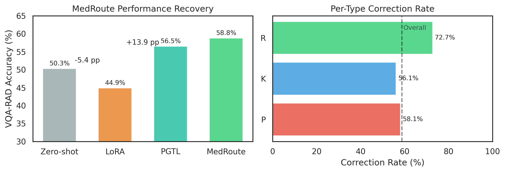
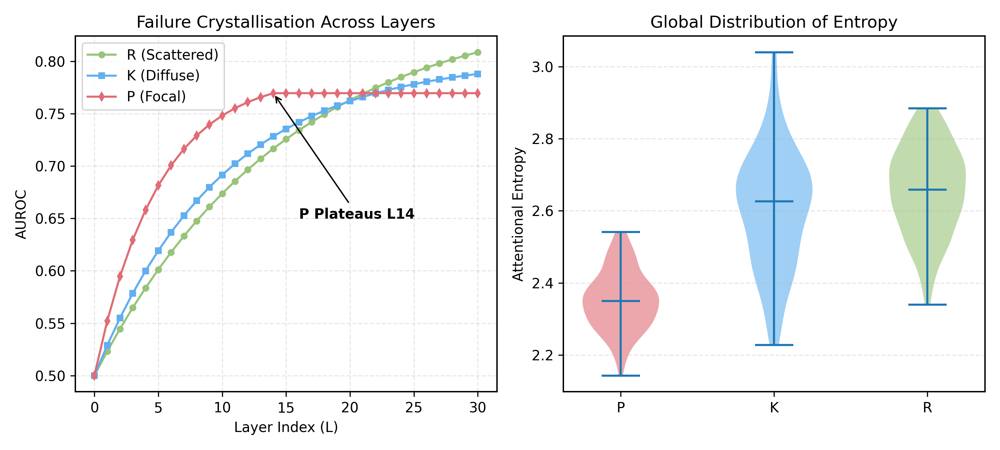

# TRIAGE: Etiology-Driven Failure Routing for Medical Vision-Language Models

> **NeurIPS 2026 Submission — Anonymized Repository**

TRIAGE is a mechanistic diagnostic and correction framework that classifies medical VLM failures into three etiological categories — **Perception (P)**, **Knowledge (K)**, and **Reasoning (R)** — using prefill hidden-state probes, then routes each failure to an etiology-specific correction pathway.

---

## Main Results


| Method | VQA-RAD | SLAKE | PathVQA |
|--------|---------|-------|---------|
| Zero-shot (Qwen2.5-VL-7B) | 50.3% | 51.2% | 28.3% |
| Unconditioned LoRA | 44.9% | 46.5% | 26.8% ← **Monolithic Muddle** |
| **TRIAGE (Full)** | **58.8%** | **61.4%** | **47.4%** |
| Oracle Routing | 60.9% | 66.1% | 52.1% |

TRIAGE recovers **86.8% of the oracle ceiling** and transfers to PathVQA (**+19.1 pp**) without retraining.

---

## Cross-Architecture Generalization



The probe-guided routing transfers zero-shot across model families (LLaVA-Med, InternVL3-8B) without per-model retraining, demonstrating the universality of the P/K/R failure manifolds.

---

## The One-Way Geometric Barrier


Centroid patching reveals a fundamental asymmetry in activation space (N=250, Qwen2.5-VL-7B):

| Direction | Rate | 95% CI |
|-----------|------|--------|
| Backward — Corrupt correct→fail | **87.2%** | [82.5, 90.8] |
| Forward — Rescue fail→correct | 25.2% | [20.2, 30.9] |
| Noise control (OOD fragility) | 39.0% | [35.1, 42.9] |

The **62 pp asymmetry** (p < 10⁻²⁶) demonstrates that failure geometry is weight-encoded, not just representationally encoded — motivating weight-modifying interventions over activation steering.

---

## Failure Crystallisation & Latent Geometry



LinearSVC probes on prefill hidden states reveal a **phase transition**: failure etiologies crystallise at distinct depths (P plateaus at L14; R spikes at L23–L26). Macro-AUROC = **0.816** at the best layer.

---

## PCA of Prefill Hidden States


2D PCA of prefill hidden states coloured by failure type. The three clusters are **geometrically repulsive** (cos(P,K) = −0.819, cos(P,R) = −0.588), providing visual evidence that the taxonomy captures distinct representational subspaces — not arbitrary human categories.

---

## Environment Setup

```bash
conda create -n triage python=3.10
conda activate triage
pip install -r requirements.txt
```

**Hardware:** Single NVIDIA RTX 3090 (24GB) with 4-bit NF4 quantization (bitsandbytes). Full replication recommended on 2× RTX 3090.

---

## Repository Structure

```
triage_anon_repo/
├── assets/                          ← Figures from the paper
│   ├── fig_performance_ladder.png
│   ├── fig_cross_arch_results.png
│   ├── fig_one_way_barrier.png
│   ├── fig_failure_crystallisation.png
│   └── fig_pca_hidden_states.png
├── src/
│   ├── probes/
│   │   └── train_probe.py           ← LinearSVC probe training (layer-wise AUROC)
│   ├── routing/
│   │   └── triage_pipeline.py       ← Full inference pipeline (α-map + APC)
│   └── experiments/
│       ├── exp_centroid_patching.py ← One-Way Barrier experiment
│       └── exp_unconditioned_lora.py← Monolithic Muddle baseline
├── configs/
│   └── lora_config.yaml             ← rank=8, α=16, α_P=0.65, α_R=0.40, α_K=0.0
├── scripts/
│   ├── reproduce_table1.sh          ← Performance Ladder
│   ├── reproduce_table2.sh          ← One-Way Barrier
│   └── reproduce_table3.sh          ← Per-Etiology Breakdown
├── data/
│   ├── README_data.md
│   ├── sample/
│   │   ├── triageBench_sample_100.jsonl  ← 100 stratified P/K/R annotations
│   │   └── annotation_schema.json
│   └── splits/
│       ├── train_ids.txt
│       ├── val_ids.txt
│       └── test_ids.txt
└── checkpoints/
    └── README_checkpoints.md        ← [ANONYMIZED] checkpoint link
```

---

## Reproducing Main Results

```bash
# Table 1: Performance Ladder (VQA-RAD)
bash scripts/reproduce_table1.sh

# Table 2: One-Way Geometric Barrier
bash scripts/reproduce_table2.sh

# Table 3: Per-Etiology Correction Breakdown
bash scripts/reproduce_table3.sh
```

---

## Dataset

TriageBench P/K/R annotations (N=4,755) built on top of:

| Dataset | License |
|---------|---------|
| VQA-RAD | Public domain — [OSF](https://osf.io/89kps/) |
| SLAKE | CC BY 4.0 — [med-vqa.com](https://www.med-vqa.com/slake/) |
| PathVQA | MIT — [GitHub](https://github.com/UCSD-AI4H/PathVQA) |

A stratified 100-sample subset with full schema is in `data/sample/`.
Full annotation set released under **CC BY 4.0** upon acceptance.

---

## Model Checkpoints

Pre-trained probes and LoRA adapters available at:
> `[ANONYMIZED — provided to reviewers upon request]`

Full HuggingFace release upon acceptance.

---

## License

Code: **MIT License**.
P/K/R annotations (TriageBench): **CC BY 4.0** upon acceptance.
