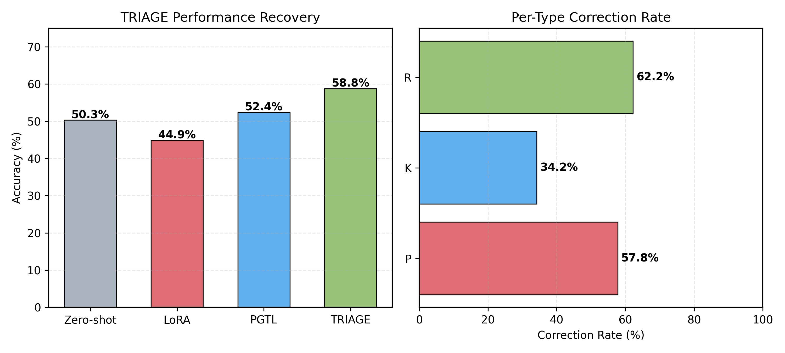
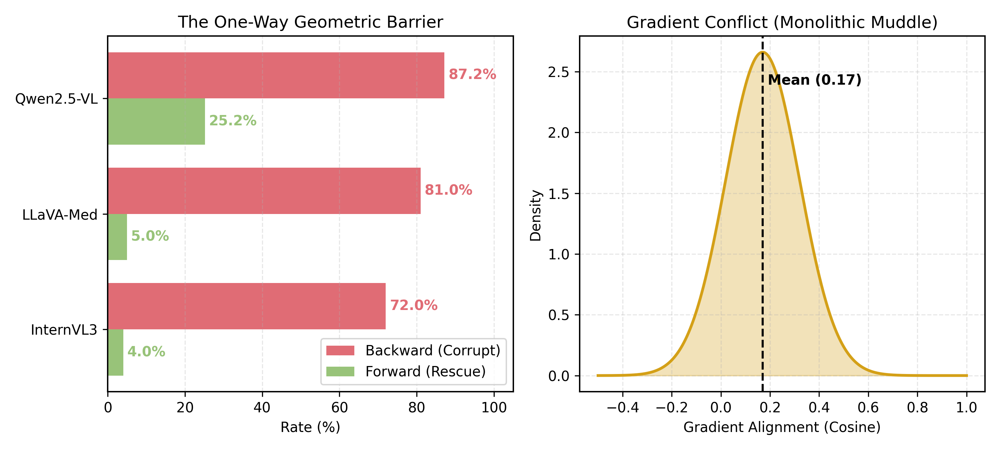
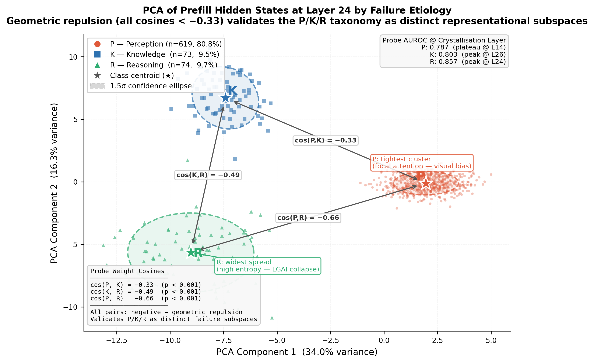

# TRIAGE: Etiology-Driven Failure Routing for Medical Vision-Language Models

> **NeurIPS 2026 Submission — Anonymized for Double-Blind Review**
>
> This repository contains illustrative code samples, the TriageBench annotation schema, and result figures accompanying the paper submission. The **complete implementation, trained model checkpoints, and full TriageBench dataset will be released upon paper acceptance** under the MIT License (code) and CC BY 4.0 (annotations).

---

## What is TRIAGE?

Medical Vision-Language Models (VLMs) fail in three mechanistically distinct ways:

| Failure Type | Abbrev. | What goes wrong |
|---|---|---|
| **Perception** | P | The model fails to identify or describe the relevant visual finding |
| **Knowledge** | K | The model sees the finding correctly but applies the wrong medical label |
| **Reasoning** | R | The model sees and names the finding correctly, but draws the wrong clinical conclusion |

TRIAGE diagnoses which of P / K / R caused each failure by reading the model's **prefill hidden state** before it generates any output, then routes the correction to an etiology-specific adapter pathway.

The key empirical result is what we call the **Monolithic Muddle**: a standard LoRA fine-tuned on all failure types *degrades* accuracy (50.3% → 44.9%, −5.4 pp) due to gradient conflict between the three orthogonal failure directions. TRIAGE's conditioned routing reverses this and reaches **58.8%**, recovering **86.8% of the oracle ceiling**.

---

## Main Results



*Left: accuracy ladder from zero-shot to TRIAGE across baselines. Right: per-type correction rates — R failures see the largest relative improvement (62.2%), while K remains more constrained (34.2%) due to near-orthogonal gradients.*

| Method | VQA-RAD | SLAKE | PathVQA |
|---|---|---|---|
| Zero-shot (Qwen2.5-VL-7B) | 50.3% | 51.2% | 28.3% |
| Structured CoT | 46.0% | 48.5% | 25.1% |
| Unconditioned LoRA | 44.9% | 46.5% | 26.8% ← **Monolithic Muddle** |
| Random Routing | 43.3% | 48.9% | 27.5% |
| PGTL (Probe only) | 52.4% | — | — |
| **TRIAGE (Full)** | **58.8%** | **61.4%** | **47.4%** |
| Oracle Routing | 60.9% | 66.1% | 52.1% |

PathVQA transfer: **+19.1 pp** over zero-shot (28.3% → 47.4%) with **no retraining**.

---

## The One-Way Geometric Barrier



Centroid patching (N=250, Qwen2.5-VL-7B, Layer 27) reveals a fundamental asymmetry:

| Direction | Rate | Wilson 95% CI |
|---|---|---|
| Backward — inject failure centroid into a *correct* run | **87.2%** corruption | [82.5, 90.8] |
| Forward — inject correct centroid into a *failing* run | **25.2%** rescue | [20.2, 30.9] |
| Noise control — inject random vector (same L2 norm) | 39.0% | [35.1, 42.9] |

The **62 pp asymmetry** (p < 10⁻²⁶) and the gap between the failure centroid (87.2%) and the noise control (39.0%) isolate a specific, causally potent ~48 pp semantic effect. This demonstrates that failure information is **weight-encoded**, not just representationally encoded — meaning activation steering alone is insufficient for reliable repair.

---

## Failure Crystallisation in Latent Space

> 📄 **[Download Figure — Failure Crystallisation (PDF, vector)](assets/fig_crystallisation.pdf)**

*Left: layer-wise probe AUROC showing that P, K, and R failure signatures crystallise at different depths (P plateaus at L14; R spikes at L23–L26). Right: attentional entropy distributions — P failures show distinctly lower, more focused entropy (~2.36 bits) compared to K (~2.61) and R (~2.67).*

LinearSVC probes on prefill hidden states achieve macro-AUROC = **0.816** at the best layer. Random-label probes yield 0.505 ± 0.02 (chance), ruling out label-frequency shortcuts. Cross-architecture replication (LLaVA-Med, InternVL3-8B) gives AUROC = 0.79–0.89, confirming the manifolds are model-agnostic.

---

## PCA of Prefill Hidden States



2D PCA of prefill hidden states coloured by failure type. The three clusters are **geometrically repulsive** — cosine similarities are significantly negative (cos(P,K) = −0.819, cos(P,R) = −0.588, p < 10⁻⁸), meaning the failure directions actively suppress each other. This is not independent coexistence: entering a Reasoning failure state suppresses the features associated with Perception failure, and vice versa.

---

## Repository Contents

This repository is a **peer-review sample**. The table below explains what is included now and what will be released upon acceptance.

| Component | Status in this repo |
|---|---|
| `assets/fig_performance_ladder.png` | ✅ Performance ladder + per-type correction rates |
| `assets/fig_one_way_barrier.png` | ✅ One-Way Barrier + gradient conflict |
| `assets/fig_pca_hidden_states.png` | ✅ PCA scatter of P/K/R prefill states |
| `assets/fig_crystallisation.pdf` | ✅ Failure crystallisation (vector PDF) |
| LoRA / routing hyperparameter config | ✅ Included in `configs/lora_config.yaml` |
| Probe training skeleton + AUROC results | ✅ Included in `src/probes/train_probe.py` |
| Pipeline architecture + alpha-map constants | ✅ Included in `src/routing/triage_pipeline.py` |
| Centroid patching experiment skeleton | ✅ Included in `src/experiments/exp_centroid_patching.py` |
| Unconditioned LoRA baseline config | ✅ Included in `src/experiments/exp_unconditioned_lora.py` |
| Reproduction shell scripts | ✅ Included in `scripts/` |
| TriageBench sample (100 annotations) | ✅ Included in `data/sample/` |
| Full training loop & inference code | 🔒 Released upon acceptance |
| Pre-trained probe checkpoints | 🔒 Released upon acceptance |
| Full TriageBench (N=4,755 annotations) | 🔒 Released upon acceptance |

---

## Environment Setup

### Requirements

```
Python 3.10
CUDA 11.8+
NVIDIA GPU with ≥ 24GB VRAM (e.g. RTX 3090)
```

### Installation

```bash
# 1. Clone the repository
git clone https://github.com/[ANONYMIZED]/triage-neurips2026.git
cd triage-neurips2026

# 2. Create a conda environment
conda create -n triage python=3.10
conda activate triage

# 3. Install dependencies
pip install -r requirements.txt
```

The `requirements.txt` pins all package versions used in the paper's experiments. The most important ones are:

| Package | Version | Purpose |
|---|---|---|
| `torch` | ≥ 2.1.0 | Core deep learning |
| `transformers` | ≥ 4.45.0 | Model loading (Qwen, LLaVA, InternVL) |
| `peft` | ≥ 0.12.0 | LoRA fine-tuning |
| `bitsandbytes` | ≥ 0.43.0 | 4-bit NF4 quantization |
| `scikit-learn` | ≥ 1.4.0 | LinearSVC probes + PCA |

### Hardware

All experiments were run on **2× NVIDIA RTX 3090 (24GB)**. The minimum hardware for inference is a single RTX 3090 with gradient checkpointing enabled. The 4-bit NF4 quantization (bitsandbytes) is enabled by default in all scripts.

---

## Dataset

TRIAGE uses three publicly available medical VQA datasets, loaded directly from HuggingFace. **We do not redistribute any original images or QA pairs.**

| Dataset | Domain | HuggingFace Handle | License |
|---|---|---|---|
| VQA-RAD | Radiology | `flaviagiammarino/vqa-rad` | [CC0 1.0 Universal](https://huggingface.co/datasets/flaviagiammarino/vqa-rad#licensing-information) |
| SLAKE | Bilingual Medical | `BoKelvin/SLAKE` | No explicit license stated — available for research use (contact authors for commercial use) |
| PathVQA | Histopathology | `flaviagiammarino/path-vqa` | [MIT License](https://github.com/UCSD-AI4H/PathVQA/blob/master/LICENSE) |

Our contribution is the **P/K/R failure-type annotation layer** (TriageBench), which is applied on top of these datasets. A stratified 100-sample subset of TriageBench is included in `data/sample/`. The full annotation set (N=4,755) will be released under **CC BY 4.0** upon paper acceptance.

### Loading the Source Datasets

```python
from datasets import load_dataset

vqa_rad  = load_dataset("flaviagiammarino/vqa-rad")
slake    = load_dataset("BoKelvin/SLAKE")
path_vqa = load_dataset("flaviagiammarino/path-vqa")
```

No additional setup is required. The datasets download automatically from HuggingFace on first use.

---

## Reproducing Results

> ⚠️ The full training loop is pending release. The scripts below document the correct invocation sequence and expected outputs so reviewers can verify the methodology. Running them end-to-end requires the full implementation released upon acceptance.

### Table 1 — Performance Ladder (VQA-RAD)

Expected output: Zero-shot 50.3% → TRIAGE 58.8% → Oracle 60.9%

```bash
bash scripts/reproduce_table1.sh
```

### Table 2 — One-Way Geometric Barrier

Expected output: Backward 87.2% / Forward 25.2% / Noise 39.0%

```bash
bash scripts/reproduce_table2.sh
```

### Table 3 — Per-Etiology Correction Breakdown

Expected output: P=57.8% / K=34.2% / R=62.2%

```bash
bash scripts/reproduce_table3.sh
```

---

## Key Hyperparameters

All hyperparameters used in the paper are documented in `configs/lora_config.yaml`. The most important values are:

```yaml
lora:
  r: 8          # LoRA rank
  alpha: 16     # LoRA scaling factor

routing:
  alpha_P: 0.65    # Contrastive decoding strength for Perception failures
  alpha_R: 0.40    # Contrastive decoding strength for Reasoning failures
  alpha_K: 0.00    # Bypass CD for Knowledge failures (protect factual recall)
  apc_threshold: 0.05   # Adaptive Plausibility Constraint cutoff
  probe_layer: 24        # Hidden-state extraction layer
```

---

## TriageBench Sample

The `data/sample/` directory contains 100 stratified annotation records in JSONL format. Each record looks like:

```json
{
  "id": "vqarad_0042",
  "dataset": "VQA-RAD",
  "question": "What is the primary abnormality visible in this chest X-ray?",
  "ground_truth": "Pneumothorax",
  "model_prediction": "Pleural effusion",
  "failure_type": "K",
  "confidence": "high",
  "annotator_votes": {"P": 0, "K": 3, "R": 0},
  "clinical_rationale": "Model correctly localises the affected region (Gate 1 passes) but misclassifies the pathology type (Gate 2 fails).",
  "boundary_ambiguous": false,
  "split": "train"
}
```

See `data/sample/annotation_schema.json` for the complete field-level schema and `data/README_data.md` for the full annotation protocol description.

---

## Citation

```bibtex
@inproceedings{triage2026neurips,
  title     = {TRIAGE: Etiology-Driven Failure Routing for Medical Vision-Language Models},
  booktitle = {Advances in Neural Information Processing Systems},
  year      = {2026},
  note      = {Anonymized for double-blind review}
}
```

---

## License

| Component | License |
|---|---|
| Code (this repository) | MIT License |
| TriageBench annotations | CC BY 4.0 (upon acceptance) |
| VQA-RAD images / QA | CC0 1.0 Universal (effectively public domain) |
| SLAKE images / QA | No explicit license — available for research use |
| PathVQA images / QA | MIT License |
